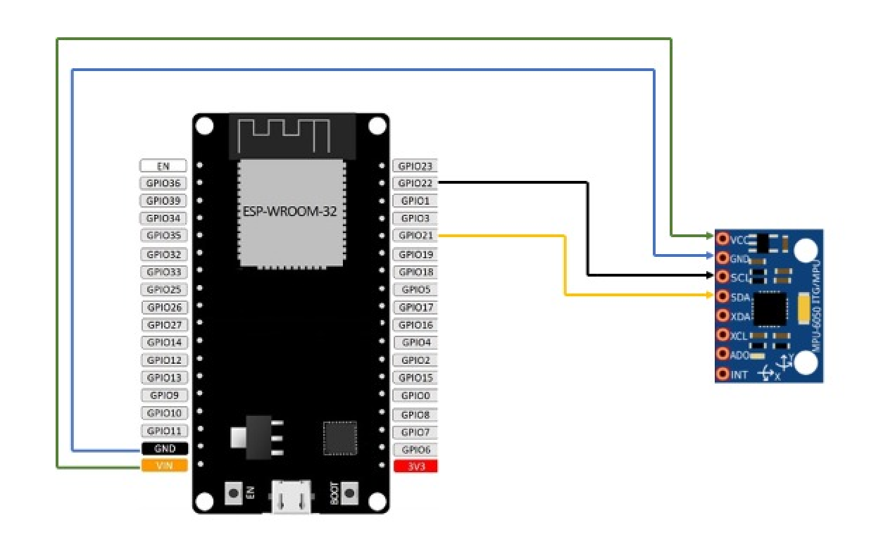

# Linear Motion for the UGV using feedback from the MPU6050 sensor

## Prerequisites

The following are the prerequisites for this manual:

- A fully assembled UGV
- A Gyro sensor. (I am using the MPU6050)
- Few wires to connect the MPU6050 to the UGV.

## More about the sensor MPU6050

The sensor can provide the following details:

- Accelerometer (x, y, z) - The acceleration in `m/s²`
- Gyroscope (x, y, z) - The angular velocity in `rad/s`
- Temperature (we don't need this)

We will use the gyroscope to measure the angle of the UGV from the original angle. Every 10ms, we fetch the gyroscope data and add it to the angle. We multiply the gyroscope data by the time interval (10ms) to get the angle change.

## Connections

Here is the connection between the UGV and the sensor:



## Dependencies

You need the following library to use the sensor. Just add the following line to your `platformio.ini` file.

```ini
lib_deps = adafruit/Adafruit MPU6050@^2.0.6
```

## Basic usage from the sensor

Here is a sample code for getting data from the sensor.

```cpp
#include <Adafruit_MPU6050.h>
#include <Adafruit_Sensor.h>
#include <Wire.h>

Adafruit_MPU6050 mpu;
Adafruit_Sensor *mpu_gyro;

void setup()
{
  Serial.begin(115200);
  while (!Serial)
    delay(10);
  if (!mpu.begin())
    Serial.println("Failed to find MPU6050 chip");
  mpu.setGyroRange(MPU6050_RANGE_500_DEG);
  mpu.setFilterBandwidth(MPU6050_BAND_21_HZ);
  mpu_gyro = mpu.getGyroSensor();
}

void loop()
{
  sensors_event_t g;
  mpu_gyro->getEvent(&g);
  Serial.print("X: ");
  Serial.print(g.gyro.x);
  Serial.print("\tY: ");
  Serial.print(g.gyro.y);
  Serial.print("\tZ: ");
  Serial.println(g.gyro.z);
  delay(10);
}
```

The sensor could have some offset. We should calibrate the sensor before using it. We can do this by taking a few measurements and averaging them for an approximate offset in x, y and z directions.

The further measurements should subtract the offset value to get the accurate reading from the sensor.

<!-- 1. Describe each dumb function in the code.
2. Explain `calibrate_gyro()` and `gyro_time`.
3. Describe the not dumb function in the code (`go_straight_line()`). Also, explain `10ms` thingy. -->

## The Functions

### `move(int dir)`

- `dir`: The direction of the movement (`1` for forward, `-1` for backward)
- This function starts moving the UGV in the direction of `dir`.

```cpp
void move(int dir)
{
  Motor1.moveMotor(dir * 2.55 * 100);
  Motor2.moveMotor(dir * 2.55 * 100);
}
```

### `stop()`

- This function stops the UGV by locking both the motors

### `turn_left()`

- This function starts turning the UGV in the left direction.

```cpp
void turn_left()
{
  Motor2.moveMotor(2.55 * 100);
  Motor1.lockMotor();
}
```

### `turn_right()`

- This function starts turning the UGV in the right direction.

```cpp
void turn_right()
{
  Motor1.moveMotor(2.55 * 100);
  Motor2.lockMotor();
}
```

### `calibrate_gyro()`

- This function calculates the offset of the gyroscope and also the `gyro_time`, which is the time it takes for the sensor to get the data.
- It takes 10 readings to calculate the average `offset` and `gyro_time`.

```cpp

static float offset_z = 0;
static long gyro_time = 0;

void calibrate_gyro()
{
  int times = 10;
  float offsets[times];
  long gyro_times[times];
  int t = times;
  while (t--)
  {
    sensors_event_t g;
    long cur = micros();
    mpu_gyro->getEvent(&g);
    cur -= micros();
    offsets[t - 1] = g.gyro.z;
    gyro_times[t - 1] = cur;
    delay(10);
  }
  times--;
  for (int i = 0; i < times; i++)
  {
    offset_z += offsets[i];
    gyro_time += gyro_times[i];
  }
  offset_z /= times;
  gyro_time /= times;
}
```

### `compare(double value1, double value2, int precision)`

- `value1`: The first value to compare.
- `value2`: The second value to compare.
- `precision`: The precision of the comparison.
- This function compares the two values and returns `false` if they are equal within the `precision`.

```cpp
bool compare(double value1, double value2, int precision)
{
  bool eq = std::abs(value1 - value2) < std::pow(10, -precision);
  return !eq;
}
```

### `update_current_angle()`

- This function updates the current angle of the UGV.

```cpp
float current_angle = 0;
const int loop_ms = 10;
// This was measured ahead of time using a magnetic compass.
static const float degrees_90 = 1.21;

void update_current_angle(int time = loop_ms)
{
  sensors_event_t g;
  mpu_gyro->getEvent(&g);
  current_angle += (g.gyro.z - offset_z) * time / 1000;
  current_angle = fmod(current_angle, degrees_90 * 4);
  Serial.println(current_angle);
}
```

### `go_straight_line()`

- This function moves the UGV in a straight line.
- It does this by comparing the current angle with the original angle (`0`).

```cpp
void go_straight_line()
{
  // Just some arbitrary value to stop the UGV after it goes below `1`.
  int l = 500;
  while (l -= 2 > 0)
  {
    if (compare(current_angle, 0, 2))
    {
      if (current_angle > 0)
        turn_left();
      else
        turn_right();
      l++;
    }
    else
    {
      move(1);
    }
    delayMicroseconds(loop_ms * 1000 - gyro_time);
    update_current_angle();
    stop();
  }
}
```

## Working

- Get the `offset` and `gyro_time`.
- When using `update_current_angle()` the offset should be subtracted from the gyroscope data.
- When running the loop, and when the `current_angle` is updated, the delay should be `loop_ms` - `gyro_time`.
- So, when the loop is running, the `current_angle` should be updated every `loop_ms` - `gyro_time` microseconds.
- In my case, it is approximately `10ms`.
- We have the `rad/s` from the gyroscope, so we can calculate the angle of the UGV by multiplying it with the time i.e. `10ms`.
- Hence, `current_angle += (g.gyro.z - offset_z) * 10 / 1000`.
- But also, we have to make sure that the angle is within the range of `0` to `360`. Hence, `current_angle = fmod(current_angle, degrees_90 * 4)`.
- Now that you have the `current_angle`, you can use it to decide the turning direction of the UGV for every `loop_ms`.

## [The Code](../codes/esp-ugv-5)
