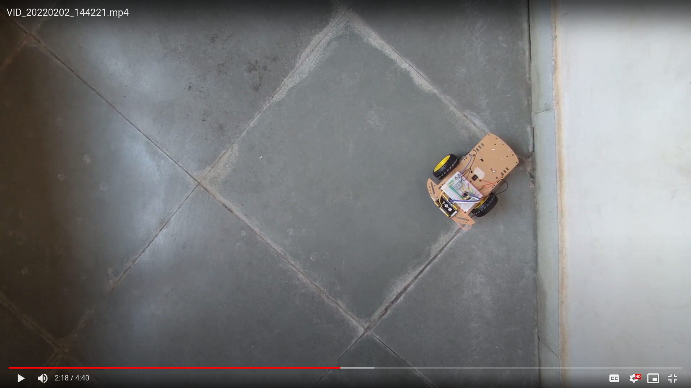
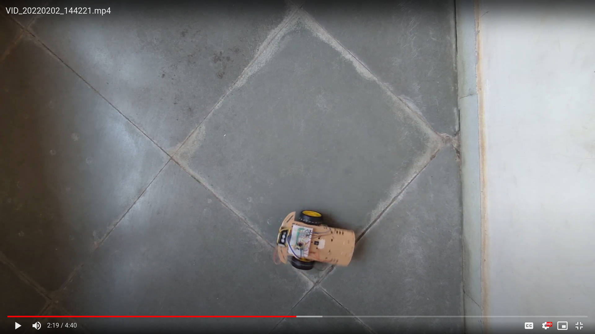
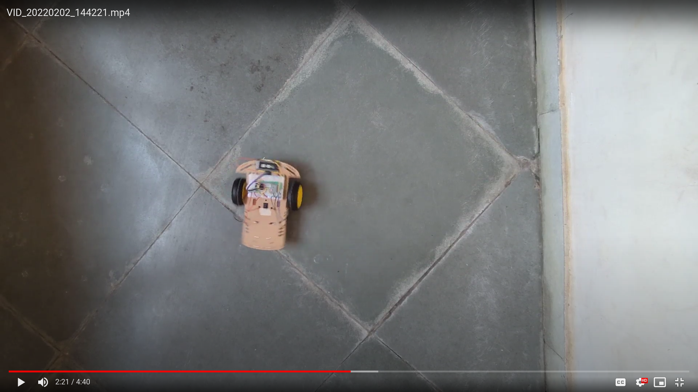
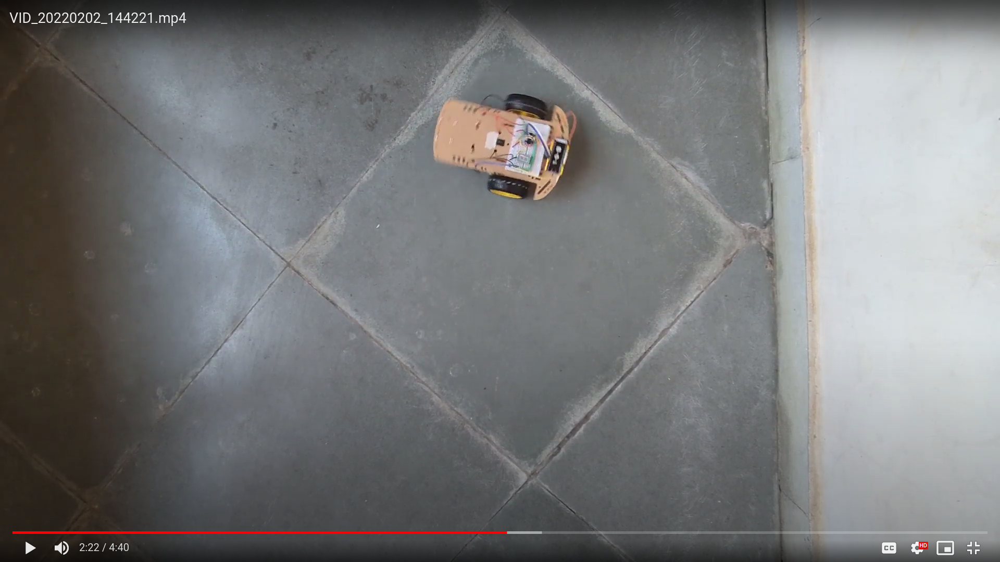
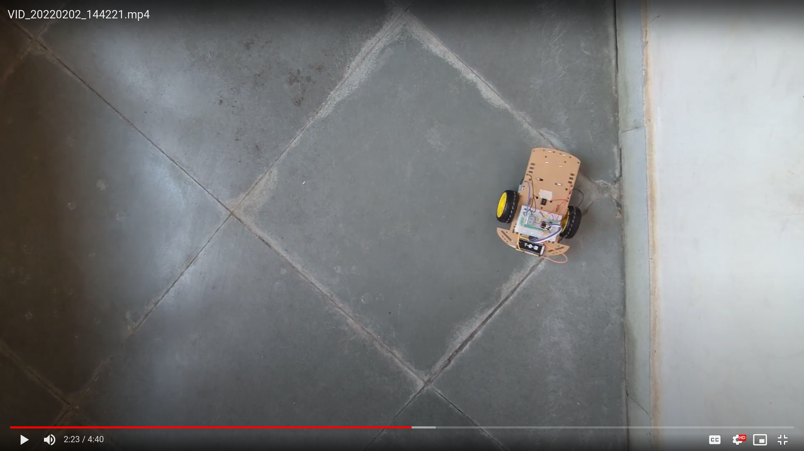

# Plotting the UGV path while tracing shapes

## Prerequisites

You will need the following to follow this manual

- A camera (your phone camera should be good enough)
- A desktop PC (any desktop OS Ubuntu, Arch, Windows or macOS)
- An Office Suite (I am using ONLYOFFICE, but most suites should work fine)
- The UGV with the path tracing code flashed into it

## Making the video

You need the video in a top down angle. Here is the RAW video I took by hanging my phone using tape off of a horizontal stick supported on two sides. You need a similar video to the one I took.

[https://drive.google.com/file/d/1TYZ-pbO6Gm8Kw9F2UgN3vuUlPIh9w6b\_/view?usp=sharing](https://drive.google.com/file/d/1TYZ-pbO6Gm8Kw9F2UgN3vuUlPIh9w6b_/view?usp=sharing)

## Getting turning frames from the video

You need to get specific frames from the video. I took the screenshot of the video when my UGV was starting, turning and stopping. Here are my screenshots.

| | | |
|---|---|---|
||||
||| |

## Plotting the path

For this step you need a `.pptx` editor. I used [ONLYOFFICE](https://www.onlyoffice.com/en-us/products/onlyoffice-presentation-editor/) to create the `.pptx` file.

- Import the first screenshot. i.e the screenshot of the UGV starting.
- Insert an arrow into the slide.
- Put the back of the arrow at an arbitrarily middle point between the wheels of the UGV.
- Remove the screenshot and insert the second screenshot. i.e the screenshot of the UGV's first turning.
- Send the screenshot to back so that it is behind the arrow.
- Now put the front of the arrow on the same arbitrary point on the UGV but in the new location of the UGV.
- Repeat this for all the turning frames. And finally for the last frame.

You will end up with something like this `.pptx` file.

[PLOTTING_PATH.pptx](PLOTTING_PATH.pptx)

Now repeat this for several runs.

## Merging the plots

Now that you have all the different slides with the different UGV paths, you can merge them into one. To do this, you will still need the `.pptx` editor.

- Delete the background images from all the slides so the only the arrows are left. Make sure that the arrows are not colored white so that it won't merge with the plain white background.
- Make a new blank slide and copy paste the first slide's arrows into it.
- Now, for each of the other slides, copy paste the arrows into the new blank slide.
- If you want a prettier plot, you could make sure that the starting point of each plot is at the same location in the merged slide.

You will end up with something like this.

## Making a video [optional]

Using some fancy video editing skills, you could make a video of the plots. Here's the one I made. Enjoy!

[Youtube link](https://youtu.be/wDQQI6Ye5tA) - [https://youtu.be/wDQQI6Ye5tA](https://youtu.be/wDQQI6Ye5tA) | [mirror](https://y.com.cm/watch?v=wDQQI6Ye5tA)
